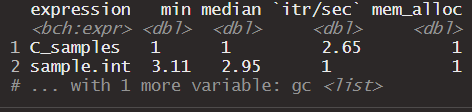
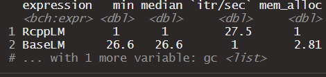

```{r, include = FALSE}
knitr::opts_chunk$set(
  collapse = TRUE,
  comment = "#>"
)
```

```{r setup}
library(blblm)
```

## blblm package

### Topics
 * Overview
 * Functions & Modifications
 * Benchmarking Results
 * Summary Examples
 * References
 
### Overview

The package blblm is a statistical analysis package used for finding the bootstrap statistic 
from a linear model. The package is able to provide the user with statistics for coefficeints, sigma, 
predicted values, and relevent confidence intervals. 

In simple terms the blblm package makes use of the bag of little bootstraps algorithm to provide the user with robust statistics. The general process is to split data into subsamples, then take many bootstrap samples of each subsamples. From the bootstrap samples the algorithm calculates relevent statistics and reduces back an average for those statistics. 

The functions provided in the blblm package make carry out this process simple by using the familiar linear model method used in linear regression. Many of the functions in this version of blblm are either modified from the original version or have been added to improve the user experience.

### Functions

>This section covers all of the modified functions and new features that have been added in hopes of  providing some small improvement to the user experince.  

#### 1. Split the data
``` r
  split_data <- function(data, m) {
  idx <- sample_intC(m, nrow(data)) #rcpp sample_int
  data %>% split(idx)
}
```
**What it does**

  The `split_data` function does exactly what you would expect. It accepts a dataframe and the number of    subsamples and splits the dataframe into m subsamples.

**Modifications**

  * The base version of blblm's `split_data` samples using base R's `sample.int`.
  * To improve the perfomance with larger datasets an RCPP version `sample_intC` has been added 
    to the function.
  * While it only provides modest improvements with small values, for larger data the `blblm` function
    that used `sample_intC` outperformed the version of `blblm` that used sample.int
  * Below is `sample_intC`
  
``` cpp
  IntegerVector sample_intC(DataFrame df,int m){
  int n=df.nrow();
  IntegerVector subs = seq(1,m);
  IntegerVector subsam = sample(subs,n,true);
  return subsam;
  }
```

#### 2. lm1C

``` r
lm1C <- function(formula, data, freqs) {
  environment(formula) <- environment()
  mf<-model.frame(formula,data) #these lines take formula and make it 
  X<-model.matrix(formula,mf)   #in a format that wt_lm can accept
  y<-model.response(mf)
  fit <- wt_lm(y,X,freqs)
  list(formula=formula,coef = blbcoef(fit,formula),sigma=blbsigmaC(fit),stderr=fit$stderr)

}
```
**What it does**
  `lm1C` acts as a stripped down version of base R's `lm` function and is a modified version of the packages original `lm1` function. It's main purpose is to take a formula, some data, and a vector of weights to then compute the coefficients, their standard error, and the value of sigma. 

**Modifications**

  * The biggest change to `lm1C` are the addition of `wt_lm` to replace base R's `lm` (see wt_lm below)
  * additionally, while base `lm` can accept a formula as its argument, `wt_lm` cannot
  * `model.frame`,`model.matrix`, & `model.response` have all been added to create acceptible arguments for `wt_lm`
  * the output for this function is a list with the coefficents, their standard error, and the value sigma
  
## 3. wt_lm

``` cpp
List wt_lm(const arma::vec &y, const arma::mat &X,const arma::vec & w) {

  int n = X.n_rows, k = X.n_cols;
  arma::mat wt = diagmat(w);
  arma::mat tx = arma::trans(X);
  arma::mat coef = solve((tx*wt)*X,(tx*wt)*y); //coef
  arma::colvec residual = y - X*coef; //residuals
  arma::vec fitval = X*coef;//fitted values
  double sig2 = arma::as_scalar(arma::trans(residual)*residual/(n-k));
  arma::colvec stderrest =
  arma::sqrt(sig2 * arma::diagvec( arma::inv(arma::trans(X)*wt*X)) );
  return List::create(Named("coefficients") = arma::trans(coef),
                      Named("stderr") = stderrest,
                      Named("fittedvals") = fitval,
                      Named("residuals") = residual,
                      Named("rank") = arma::rank(X),
                      Named("response") = y,
                      Named("weights") = w);
}
```
**What it does**
  `wt_lm` is one of three new functions added to the package and the most critical. This Rcpp function 
  provides the estimates used in every calculation in the package. Without it, the package will not work.
  The key benefit of `wt_lm` over `lm` is speed. When benchmarked against base blblm and using B=5000, the blblm version that made use of wt_lm performed between 2 and 3 times as fast.In one iteration, the modified function performed 4.5x as fast. In larger data problems the use of the rcpp version of lm has a large advatage over base lm().
  
**Modifications**
  
  * This function is based on `fastLM` from the _RCPP gallery_. (see references)
  * The most apparent modification to this formula is changing the calculation of the coefficeints so that the weights are accounted. The formula $(X^TWX)^{-1}X^TWy$ is used for these calculations. 
  * Additionally, to calculate the stadard for the coefficeints the formula $\sigma^2(X^TWX)$ was applied.
  * To make use of the function `blblmsigma`, wt_lm also provides rank, resuduals, and weights for easily calculation of sigma from the estimates keeping in line with blbm requirements for sigma which differ from the standard linear model's sigma.
  
#### 4. par_blblm 

``` r
par_blblm <-function(formula, data,m=10,B=5000,cl) {
  data_list<-split_data(data,m)
  estimates<-parLapply(cl,data_list,function(formula,data,n,B){
    lm_each_subsample(formula=formula,data=data,n=nrow(data),B=B)},
    formula=formula,n=nrow(data),B=B)
  results<-list(estimates=estimates,formula=formula)
  class(results) <-"blblm"
  invisible(results)
}

```
**What it does**
 This is the second completely new function added to the package blblm. `par_blblm` allows for parallization of the bag of little bootstraps algorithm.
 This can be extremely useful when working with big data as it allows the process to take place across multiple clusters.

**Modifications**
 
 * This function is essentially the same as base blblm except it makes use of `parLapply` from the parallel package. 
 * This function allows flexibility from the user as it is the user's decision to create the desired number of clusers using `makeCluster()`
 * This function also makes us of the Rcpp wt_lm function adding further performance enhancement.
 * an example of the process used can be seen in the "examples" section
 
#### 5 par_blblm_chunk

**What it does**
  Almost identical to `par_blblm` this version of the function `par_blblm_chunk` allows the user to make use of chunking in performing calculations of the blblm algorithm. As with `par_blblm` this function requires the parallel package and the user to create the cluster before implementing the function.
  
**Modifications**

 * This function adds an additional argument `ck` which is the number of chunks to be used in the parallelization.
 * an example of this process can be seen in the 'examples' section
 
### 6 coef

``` r
blbcoef <- function(fit,formula) {
  cf<-coef(fit)
  parm <- attr(terms(formula), "term.labels") #capture names
  labs<-c("int",parm) #include intercept
  names(cf)<-labs #assign names
  cf #return coefficients

}
```
**What it does**
 `blblcoef` and `coef.blblm` exist to return the average coefficeints from the blblm caclculations.

**Modifications**
 
 * The functions were modified in order to assign names to each of the coefficients.
 * This allows the output from the lm and blblm functions to be more transparent and informative to the user.
 * These changes were also needed to allow `confint` to function properly as it depends on user provided feature names. 
 
### Benchmarking Results

This section includes the results of a benchmarks testing the performance enhances made to this package. 

**sample_intC**

```{r echo=FALSE, out.width='60%'}

```

**wt_lm vs lm**

```{r echo=FALSE, out.width='60%'}

```

**New vs Old**

```{r echo=FALSE, out.width='60%'}
knitr::include_graphics("allbm.PNG")
```

### Examples

This section includes examples of how each function could be used in a practical setting.

``` r
library(blblm)
# Updated version which uses cpp for lm
fit <- blblm(mpg ~ wt * hp, data = mtcars, m = 3, B = 100)

# Parallelization
library(parallel)
cl<-makeCluster(4)
fit <- par_blblm(mpg ~ wt * hp, data = mtcars, m = 3, B = 100,cl) 
stopCluster(cl)

# Parallelization with chunking
library(parallel)
cl<-makeCluster(4)
fit <- par_blblm_chunk(mpg ~ wt * hp, data = mtcars, m = 3, B = 100,cl,2) #2 chunks
stopCluster(cl)

coef(fit)
#> (Intercept)          wt          hp       wt:hp 
#> 48.88428523 -7.88702986 -0.11576659  0.02600976

confint(fit, c("wt", "hp"))
#>           2.5%       97.5%
#> wt -10.7902240 -5.61586271
#> hp  -0.1960903 -0.07049867

sigma(fit)
#> [1] 1.838911
sigma(fit, confidence = TRUE)
#>    sigma      lwr      upr 
#> 1.838911 1.350269 2.276347

predict(fit, data.frame(wt = c(2.5, 3), hp = c(150, 170)))
#>        1        2 
#> 21.55538 18.80785

predict(fit, data.frame(wt = c(2.5, 3), hp = c(150, 170)), confidence = TRUE)
#>        fit      lwr      upr
#> 1 21.55538 20.02457 22.48764
#> 2 18.80785 17.50654 19.71772

```


### References

 1. *Fast Linear Models with Armadillo.* Dirk Eddelbuettel, Dec 19, 2012
     <https://gallery.rcpp.org/articles/fast-linear-model-with-armadillo/.>
 2. *blblm* Randy Lai. <https://github.com/ucdavis-sta141c-sq-2020/blblm>
 
  
  
  
